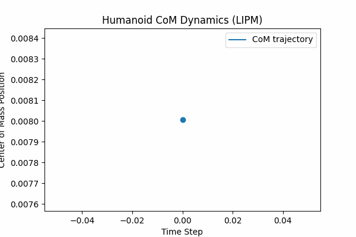
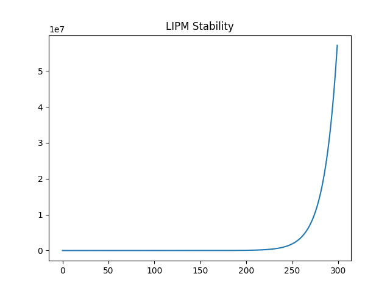

# Humanoid Locomotion Lab

Research-style humanoid locomotion framework implementing classical and modern control approaches for bipedal walking.

This project implements a modular simulation and control pipeline for humanoid locomotion based on the Linear Inverted Pendulum Model (LIPM), Zero Moment Point (ZMP) control, and Model Predictive Control (MPC).

The goal of this project is to explore stable humanoid walking dynamics using physics simulation.

---

# System Architecture

Humanoid locomotion pipeline:

Perception / State Estimation
↓
LIPM Dynamics Model
↓
ZMP / Capture Point Control
↓
Footstep Planning
↓
Trajectory Generation
↓
Inverse Kinematics
↓
Physics Simulation (PyBullet)

---

# Algorithms Implemented

### Linear Inverted Pendulum Model (LIPM)

Models humanoid balance assuming the center of mass moves on a plane with constant height.

### Zero Moment Point (ZMP)

Maintains dynamic stability by controlling the point where net moment equals zero.

### Capture Point Control

Used for push recovery and disturbance rejection.

### Model Predictive Control (MPC)

Optimizes center of mass trajectory over a prediction horizon.

### Footstep Planning

Generates alternating foot placements for walking.

### Inverse Kinematics

Solves joint configurations for leg motion.

---

# Simulation

Physics simulation is performed using PyBullet.

Run the simulation:

```
python humanoid/simulation/simulation_runner.py
```

---

# Visualization

Walking trajectory visualization:



---

# Stability Analysis

Center of mass stability using LIPM dynamics.



---

# Repository Structure

```
humanoid-locomotion-lab
│
├── configs
│   ├── gait.yaml
│   └── robot.yaml
│
├── humanoid
│   ├── locomotion
│   │   ├── lipm_dynamics.py
│   │   ├── zmp_controller.py
│   │   ├── capture_point.py
│   │   └── mpc_controller.py
│   │
│   ├── control
│   │   ├── footstep_planner.py
│   │   ├── trajectory_generator.py
│   │   └── inverse_kinematics.py
│   │
│   ├── simulation
│   │   ├── pybullet_env.py
│   │   └── simulation_runner.py
│   │
│   └── utils
│
├── experiments
│   ├── stability_analysis.py
│   └── push_recovery_test.py
│
├── scripts
│   └── generate_gif.py
│
├── models
│   └── humanoid
│       └── humanoid.urdf
│
├── tests
│
├── results
│   ├── gifs
│   └── plots
│
└── requirements.txt
```

---

# Installation

Clone the repository:

```
git clone https://github.com/GauravR2012/humanoid-locomotion-lab.git
cd humanoid-locomotion-lab
```

Create virtual environment:

```
python -m venv venv
```

Activate environment:

Windows:

```
.\venv\Scripts\Activate.ps1
```

Install dependencies:

```
pip install -r requirements.txt
```

---

# Running Experiments

Generate visualization:

```
python scripts/generate_gif.py
```

Run stability experiment:

```
python -m experiments.stability_analysis
```

---

# Future Work

Planned extensions:

* Whole-body humanoid dynamics
* Reinforcement learning locomotion
* Terrain-adaptive walking
* ROS2 integration
* Real humanoid robot deployment

---

# License

MIT License

